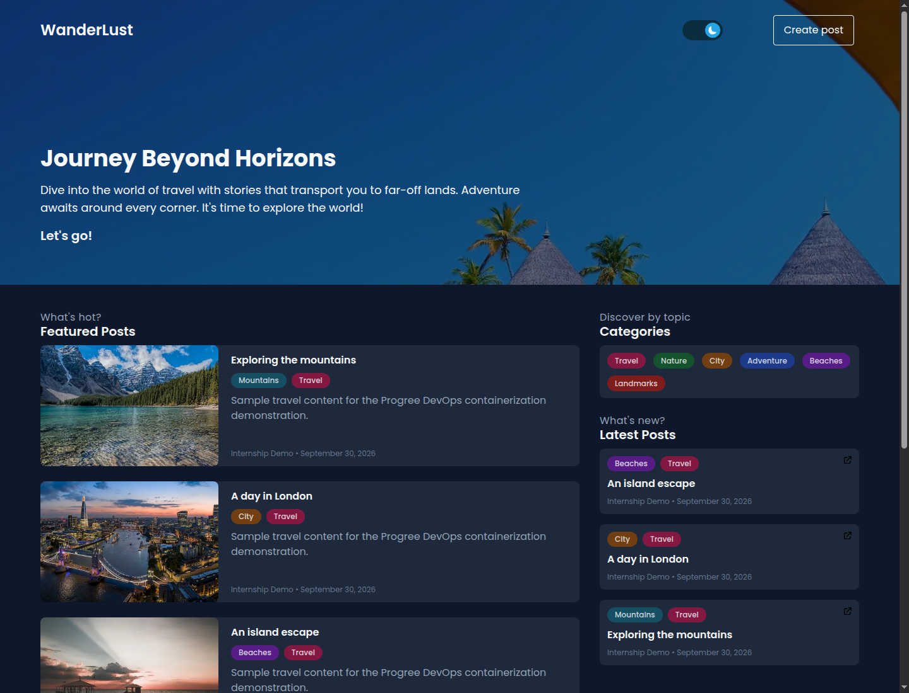

# Progree DevOps Internship — Haseeb Ullah

A DevOps portfolio project built around the MIT-licensed **Wanderlust** travel
blog application. Task 2 packages a React frontend, an Express API, MongoDB, and
Redis into an isolated Docker Compose environment.

> Application credit: [Krishna R Acharya and Wanderlust contributors](https://github.com/krishnaacharyaa/wanderlust).
> My contribution is the container infrastructure, runtime configuration,
> verification, and internship documentation. The original [MIT license](LICENSE)
> and [upstream setup guide](docs/upstream-wanderlust.md) are preserved.

[](https://github.com/haseeb9876/progree-devops-internship/actions/workflows/task3-ci-cd.yml)

## Run locally

On Ubuntu with Docker Engine, Docker Compose, and Python 3 installed:

```bash
python3 scripts/setup-local.py
docker compose up -d --build --wait --wait-timeout 180
python3 scripts/seed-demo.py
```

Open **http://localhost:8080**. The setup script generates private local
credentials and preserves them on subsequent runs. No cloud account is needed.

## Task 2 deliverables

- Multi-stage frontend and backend Dockerfiles.
- Small runtime images: static frontend assets and production-only backend dependencies.
- Compose secret files, an application-scoped database user, and excluded local credentials.
- Nginx routing for the website and API through one localhost port.
- Private database/cache networking, persistent MongoDB volumes, and service health checks.
- Repeatable HTTP checks, data-persistence verification, and image-size evidence.

Read the [Task 2 guide](docs/task-2/README.md) for requirement mapping, architecture,
configuration, troubleshooting, and operational limits.

```bash
docker compose ps
python3 scripts/verify-task2.py --recreate
```

The verification creates and removes its own test post. The `--recreate` option
recreates only this project's containers to prove data persists in named volumes.

## Evidence

[Download the Task 2 PDF report](docs/task-2/Task-2-Containerization-Report.pdf).



Measured results, application screenshots, and the Task 2 report are stored in
[docs/task-2](docs/task-2/). The report is a component for the final combined
internship PDF; it is not a claim that Tasks 3 and 4 are completed.

## Task 3: automated CI/CD

Every push triggers linting, TypeScript checks, 28 backend unit tests and 12
frontend unit/component tests. Successful checks gate image builds and a real,
temporary Docker Compose deployment on a GitHub-hosted runner. The deployment
verifies image identity, the pushed commit, readiness, and API behavior, then
cleans up and publishes status metrics and evidence.

- [Workflow and execution history](https://github.com/haseeb9876/progree-devops-internship/actions/workflows/task3-ci-cd.yml)
- [Task 3 guide](docs/task-3/README.md)
- [Successful run and failure-gate evidence](docs/task-3/evidence/README.md)
- [Task 3 PDF report](docs/task-3/Task-3-CICD-Report.pdf)

The runner deployment is removed after testing. It does not replace the local
Task 2 application or provide a permanent public website. Pull requests run
quality/build checks without deployment.

## Stop

```bash
docker compose down
```

This preserves database volumes. Keep `.secrets/` alongside the local project;
it is intentionally excluded from Git. See the guide before rotating credentials.

## Scope

This is a localhost internship demonstration. It reuses the upstream application;
OAuth and a production application-security review are outside Task 2. Task 3 adds verified CI/CD. Task 4 (Terraform/Kubernetes) remains separate work.
