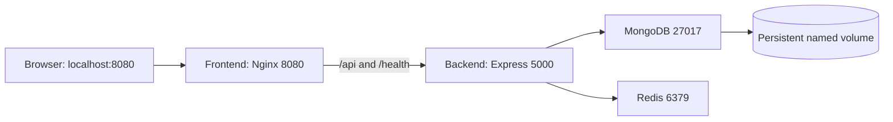

# Task 2 — Application Containerization & Asset Optimization

Author: Haseeb Ullah. Internship: Progree.

This work containerizes the MIT-licensed Wanderlust application by Krishna R Acharya.
The application is reused; the Docker packaging, operational configuration,
verification scripts, and internship documentation are the portfolio contribution.
The original LICENSE is retained at the repository root.

## Requirement mapping

| Assignment requirement | Implementation | Verification |
| --- | --- | --- |
| Multi-dependency application | React/Nginx, Express, MongoDB, Redis | Four healthy Compose services |
| Multi-stage Dockerfiles | Frontend build/runtime; backend dependencies/runtime | Successful Docker builds |
| Minimize final image footprint | Alpine images, production-only backend dependencies, frontend static assets, narrow copy rules, .dockerignore | Measured image comparison in evidence |
| Secure environment configuration | Non-secret runtime variables, Compose secret files, restricted MongoDB application user | Credentials excluded from Git, build contexts, and image configuration |
| Functional port mapping | localhost:8080 to frontend:8080; /api to backend:5000; database:27017 and cache:6379 internal only | HTTP integration checks and published-port inspection |

## Architecture



The frontend and backend share the web network. MongoDB and Redis use the
internal data network, which the backend also joins. Database and cache ports
are not published on the host. Only the web port is bound, on 127.0.0.1.

## Start on Ubuntu

Requirements: Git, Python 3, Docker Engine and Docker Compose v2 or newer.

```bash
python3 scripts/setup-local.py
docker compose up -d --build --wait --wait-timeout 180
python3 scripts/seed-demo.py
```

Open http://localhost:8080. If 8080 is occupied, set WEB_PORT in the root .env
and supply the corresponding --url to the Python scripts. An empty
VITE_API_PATH is embedded at build time so browser API requests use the same
origin; it is public configuration, never a place for credentials.

## Verify and collect evidence

```bash
docker compose ps
python3 scripts/verify-task2.py --recreate
```

The recreation check temporarily restarts only this Compose project's services.
It creates a test post, warms the Redis cache, updates the post, recreates all
containers without deleting volumes, verifies persistence, and deletes its
own post. It also verifies direct SPA navigation and invalid-input rejection.
It does not delete other posts or other Docker projects.

The inherited application has no editing UI; updates are demonstrated via the
API. Existing sign-in/sign-up screens are presentation-only upstream; the
email/password backend can be tested independently. Google/GitHub OAuth requires
provider credentials and is outside this containerization demonstration.

## Credentials and runtime behavior

The setup script generates four random values in .secrets/ without printing
them or overwriting existing files. The host directory is mode 0700. Individual
files are readable by container user IDs through read-only mounts; the private
parent restricts host access. Compose secrets are local files, not an encrypted
secret vault. Keep this directory private and back it up with your database.

MongoDB's root account initializes a separate readWrite user scoped to the
wanderlust database. The backend receives only that application's password,
the Redis password, and the JWT signing secret. It never receives MongoDB's
root password. MongoDB user initialization runs only on an empty data volume;
changing the file alone does not rotate an existing database user's password.

Frontend/backend/Redis run as non-root users. Frontend/backend filesystems are
read-only with temporary scratch space. Health checks and dependency ordering
prevent the frontend from starting before the backend is ready. The backend
awaits dependencies before listening and closes connections on SIGTERM.
Connection logs do not include credential-bearing URLs.

Cookies use SameSite=Lax and COOKIE_SECURE=false for this localhost HTTP demo.
Use HTTPS and secure cookies for a public deployment. The inherited post API
has no authorization requirement; this setup is bound to localhost and is not
presented as a production security audit. Existing application dependency
upgrades and OAuth integration are separate work.

Redis is a disposable cache; MongoDB is the source of truth. Cache entries
are invalidated after writes so updates and deletes appear in list routes.

## Image comparison

```bash
docker build -f docker/benchmark/backend.Dockerfile -t progree-wanderlust-backend:baseline backend
docker build --target build -t progree-wanderlust-frontend:build-stage frontend
docker image inspect progree-wanderlust-backend:baseline progree-wanderlust-backend:task2 progree-wanderlust-frontend:build-stage progree-wanderlust-frontend:task2 --format '{{.RepoTags}} {{.Size}}'
```

Compare the .Size values reported by Docker image inspect on this engine.
These are engine-reported image sizes, not a measurement of unique disk savings. The backend baseline contains development tools
and source. The frontend comparison is build-stage versus runtime, showing the
benefit of shipping static assets without Node and the build toolchain.

## Stop and restart

```bash
docker compose stop
docker compose start --wait
# Remove containers/networks but preserve data:
docker compose down
# Recreate later with the same data and credentials:
docker compose up -d --wait
```

Do not add --volumes to down unless intentionally deleting this project's data.

## Troubleshooting

- `docker compose ps` lists service health; `docker compose logs --tail=60 backend` shows startup status.
- A database authentication error after changing secrets needs proper password rotation or a deliberately fresh database; do not blindly delete volumes.
- Build errors fetching dependencies require network access to Docker Hub and npm.
- External travel images need internet access in the browser.

## Generate the PDF report

With the optional Python `reportlab` package installed, run:

```bash
python3 scripts/capture-evidence.py
python3 scripts/build-task2-report.py
```

The report uses the recorded integration results and browser screenshots in
`evidence/`. Re-run verification and refresh screenshots after changing the app.
Report generation is optional; running the application does not require ReportLab.

## Submission

Task 2 evidence belongs in the final combined internship PDF alongside the other
completed tasks. The stated deadline is 5 October 2026. GitHub is a portfolio copy;
submission is through the organizer's Google Form. A Task 2-only report is not
the final combined submission.

## References

- [Docker multi-stage builds](https://docs.docker.com/build/building/multi-stage/)
- [Docker Compose secrets](https://docs.docker.com/compose/how-tos/use-secrets/)
- [Original Wanderlust project](https://github.com/krishnaacharyaa/wanderlust)
